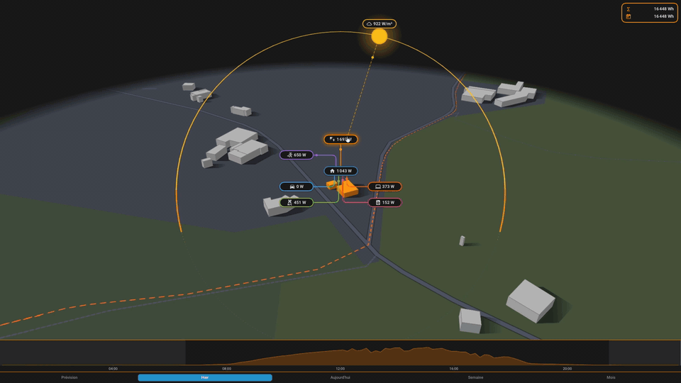
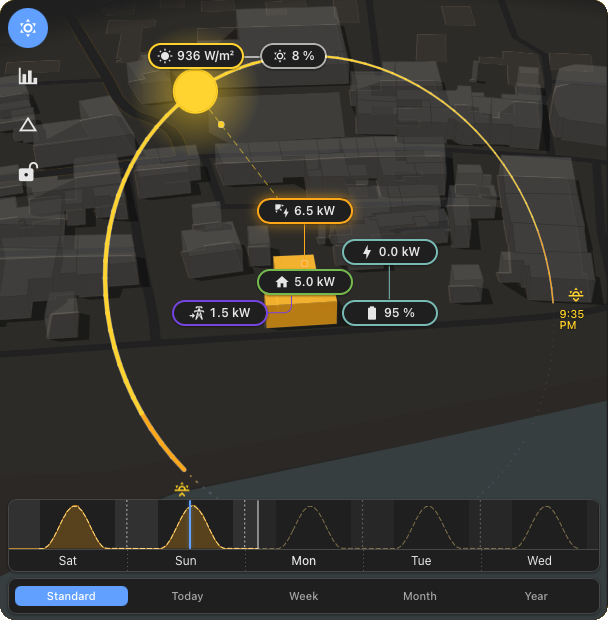
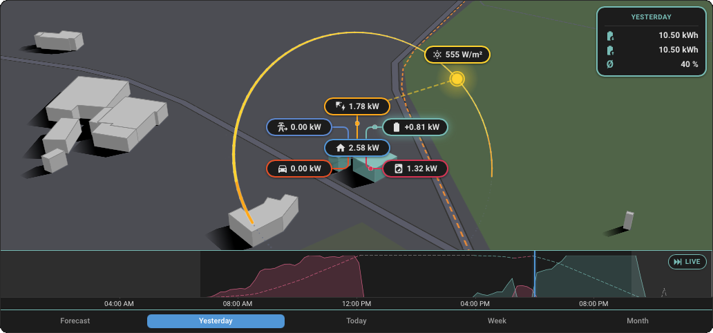
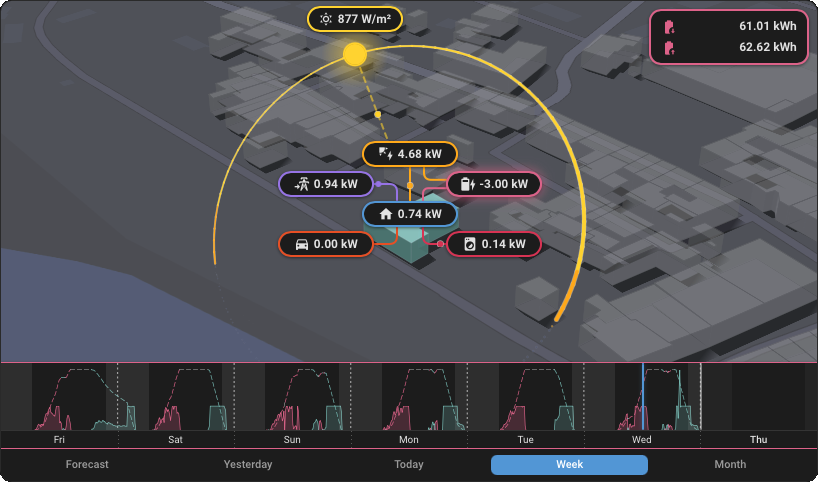

<div align="center">


# HELIOS

**Make your energy visible, in 2.5D.**

A Home Assistant card that turns your Energy dashboard into a living scene:
what your home produces, stores and consumes, as the sun crosses your sky.



[**Live demo**](https://helios-ha.org/helios/) &nbsp;&nbsp; [**Documentation**](https://helios-ha.org/help/) &nbsp;&nbsp; [**Roadmap**](https://helios-ha.org/roadmap/)

[](https://hacs.xyz/)
[](https://www.gnu.org/licenses/gpl-3.0)
[](https://github.com/ReikanYsora/Helios/stargazers)
[](https://www.buymeacoffee.com/reikanysora)

</div>

---

## Install

1. Open **HACS**, search for **Helios**, install it.
2. Reload your browser.
3. On your dashboard: **Edit**, then **+ Add card**, then search **Helios**.

That is the whole setup. Helios reads the **Energy dashboard you already
configured** and wires itself from it: solar, grid, battery and the devices you
track. No API key, no account, no per-card entity list to fill in.

It works **with or without solar panels**. Without them you get the sun, your
home and your consumption; the production layers simply do not appear.

<details>
<summary>Manual install, without HACS</summary>

1. Download `helios.js` from the [latest release](https://github.com/ReikanYsora/Helios/releases).
2. Copy it to `<config>/www/community/helios/`.
3. In `Settings` > `Dashboards` > three-dot menu > `Resources`, add:
   ```yaml
   url: /local/community/helios/helios.js
   type: module
   ```
4. Hard-refresh your browser.

</details>

---

## What you get

* **The sun's real arc** over your own address, with the live sun disc, the
  incidence ray and the irradiance reading, sunrise and sunset placed where the
  arc meets your horizon.
* **Live flows**, production, grid and battery, each with a bead that travels to
  the home at the speed of the power it carries.
* **A timeline you can scrub**, two days back and two days forward. The whole
  scene follows: sun, shadows, clouds, every value.
* **The day's curve**, your production or consumption standing on the sun's own
  path around the house, so where a point sits on it *is* the hour.
* **Your devices, grouped**, up to four groups with their own name, colour and
  icon, each with a chip and a curve of its own.
* **Cast shadows** from the buildings around you, projected from real
  footprints, fading as the sun nears the horizon.
* **Built for a wall**, an optional mode that fades the controls away after a
  few seconds and leaves only the scene.

Every option is in the visual editor, and the full reference is in the
[documentation](https://helios-ha.org/help/).

---

## Where the numbers come from

Helios follows your Energy dashboard and **never estimates a value**.

A **chip** is always a real-time measurement, read from the live power sensor of
that source. If a source has no live sensor, its chip is not shown and the
editor tells you which one is missing. Nothing is ever derived from a cumulative
meter to fake a "now".

A **curve or a total** is always your own meter data, read through the recorder
statistics: the exact numbers the official Energy dashboard's bars are made of.
Where the dashboard has a figure, Helios shows the same figure.

**Home consumption** is the dashboard's own balance, solar plus import minus
export minus battery, and it appears only once every configured family has a
live sensor to compute it honestly.

If a sensor is detected as mis-wired, Helios hides the affected chips and the
editor explains what to fix, rather than showing a number you cannot trust.

---

## Local by design

Your solar, battery and grid figures never leave your browser. There is no
Helios server, no account and no telemetry.

Two open services are used, neither needs a key: [Open-Meteo](https://open-meteo.com/)
for the weather, and [OpenFreeMap](https://openfreemap.org/) for the map tiles
the ground is drawn from.

The scene is painted by a self-contained **2.5D engine with no WebGL**: a tilted
vector basemap on a canvas with every overlay projected on top in SVG. Light
enough to stay fluid on a phone, a tablet or an old wall panel, and where a
classic 3D render will not run, this one does.

---

## Also in the Helios family

**[Helios Forecast](https://github.com/ReikanYsora/Helios-Forecast)** is a
solar production forecast that learns from your own panels and runs entirely on
your Home Assistant. It feeds the official Energy dashboard, corrects itself
against what your installation really produces, and exposes a clean set of
sensors. Helios draws its prediction as the dashed curve your production tracks
against.

---

<details>
<summary><b>Screenshots</b>, updated every release</summary>

<br>







An interactive live demo is at [helios-ha.org](https://helios-ha.org/helios/).

</details>

---

## Documentation

| | |
| :-- | :-- |
| [Configuration reference](docs/CONFIGURATION.md) | Every option, in the editor and in YAML |
| [Architecture](ARCHITECTURE.md) | How the engine, the solar maths and the data layer work |
| [Development](docs/DEVELOPMENT.md) | Building from source, and where everything lives |
| [Changelog](CHANGELOG.md) | What changed, release by release |
| [helios-ha.org](https://helios-ha.org) | Live demo, guides and the public roadmap |

---

## Support the project

Helios is built and maintained by one person, in the open, and given away. If it
earns a place on your dashboard, a **star** costs nothing and helps more people
find it. A coffee keeps the next cycle going.

<div align="center">
<a href="https://www.buymeacoffee.com/reikanysora"></a>
</div>

Found a bug or missing something? [Open an issue](https://github.com/ReikanYsora/Helios/issues).
Every idea on the roadmap came from a user.

---

## Credits

Helios stands on open data, none of which requires an account or a key:
[OpenFreeMap](https://openfreemap.org/) for the vector basemap,
[OpenStreetMap](https://www.openstreetmap.org/copyright) contributors for the map
and the building footprints, [Open-Meteo](https://open-meteo.com/) for the
weather, and the Home Assistant Energy dashboard for every energy figure.
Bundled alongside [Lit](https://lit.dev/):
[polygon-clipping](https://github.com/mfogel/polygon-clipping) by Mike Fogel (MIT).

And thank you to everyone who tried Helios, filed an issue, suggested an idea or
just shared a screenshot. That feedback is what shaped the card.

---

## License

HELIOS, an energy visualisation card for Home Assistant.
Copyright (C) 2026 Jérôme CREMOUX (ReikanYsora).

Licensed under the GNU General Public License v3.0, see [LICENSE](LICENSE).
